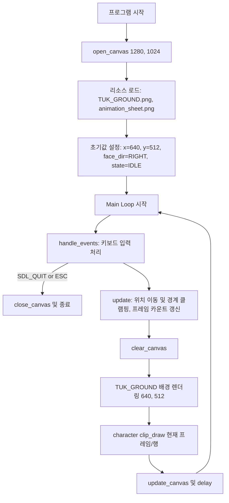

# [PRD] 4방향 캐릭터 이동 및 애니메이션 제어 시스템 (Drill #9)

## 1. 프로젝트 개요

- **문서명**: `PRD.md` (Product Requirements Document)
- **대상 파일**: `DRILL9.py` (단일 파이썬 스크립트)
- **개발 환경 / 라이브러리**: Python 3.x / `pico2d`
- **사용 리소스**:
  - `animation_sheet.png` (802 x 402 픽셀, 8열 x 4행 스프라이트 시트)
  - `TUK_GROUND.png` (1280 x 1024 픽셀 배경 이미지)
- **캔버스 크기**: 1280 x 1024 픽셀 (`TUK_GROUND.png` 크기와 1:1 매칭)
- **프로젝트 목적**:
  키보드 방향키(상/하/좌/우) 입력에 따라 캐릭터가 배경 화면 위를 자유롭게 이동하며, 상태(대기/이동)와 시선 방향(좌/우)에 맞추어 `animation_sheet.png`의 프레임을 부드럽게 렌더링하고, 화면 밖으로 이탈하지 않도록 경계 처리를 구현한다.

---

## 2. 세부 요구사항

### 2.1 기능적 요구사항 (Functional Requirements)

1. **배경 렌더링 (Background Display)**:
   - 캔버스 크기를 1280 x 1024로 생성하고, 매 프레임마다 `TUK_GROUND.png`를 캔버스 중앙 `(640, 512)`에 전체 화면 배경으로 출력한다.

2. **기본 상태 및 대기 모션 (IDLE State)**:
   - 방향키 입력이 없거나 이동을 멈춘 상태에서는 제자리 대기(`IDLE`) 애니메이션을 재생한다.
   - 캐릭터가 멈출 때, 마지막으로 바라보던 좌/우 방향을 그대로 유지한 채 해당 방향의 IDLE 애니메이션을 8프레임 루프로 순환 재생한다.

3. **이동 및 방향 제어 (Movement & Direction Handling)**:
   - **4방향 이동**: 방향키(좌 `LEFT`, 우 `RIGHT`, 상 `UP`, 하 `DOWN`)를 누르면 해당 축 방향으로 캐릭터가 일정 속도(예: 5 px/frame 또는 시간 기반)로 이동한다.
   - **대각선 복합 이동**: 좌/우 키와 상/하 키를 동시에 누를 경우 대각선 방향으로 부드럽게 이동한다.
   - **이동 애니메이션**: 이동 중(`RUN` 상태)에는 이동 방향에 맞는 달리기 애니메이션(8프레임 루프)을 재생한다.
   - **상/하 이동 시 시선 유지**: 좌/우 입력 없이 상/하 방향키만 눌러 수직 이동할 때에는, **직전에 바라보던 좌/우 방향을 그대로 유지**하며 해당 방향의 달리기 애니메이션을 재생한다.
   - **키 입력 해제 (KeyUp)**: 방향키를 뗄 때 누적 방향 벡터를 정상적으로 차감하며, 모든 키가 떨어지면 마지막 방향을 바라본 상태에서 `IDLE` 상태로 매끄럽게 복귀한다.

4. **화면 경계 처리 (Boundary Clamping)**:
   - 캐릭터의 중심 좌표 `(x, y)`가 윈도우 캔버스(1280 x 1024) 및 배경 영역 밖으로 벗어나지 않도록 이동 범위를 제한한다.
   - 스프라이트 크기(100 x 100)를 고려하여 캐릭터가 화면 밖으로 잘리지 않도록 경계 여백(여백 50 px 기준 `50 <= x <= 1230`, `50 <= y <= 974`)을 적용한다.

5. **이벤트 제어 및 안전한 종료 (Event Handling & Exit)**:
   - `ESC` 키 입력 또는 윈도우 창 닫기 버튼(`SDL_QUIT`) 이벤트 수신 시 루프를 종료하고 `close_canvas()`를 호출하여 정상 종료한다.

### 2.2 기술적 제약사항 (Technical Constraints)

- **단일 스크립트 원칙**: 모든 로직은 `Labs/LEC10_HandlingInputs/DRILL9.py` 단일 파일 내에 작성한다.
- **구조화된 루프 설계**: `handle_events()`, `update()`, `render()` 역할이 명확히 분리된 구조로 작성한다.
- **안정적인 프레임 제어**: 애니메이션 및 프레임 갱신 주기를 제어하여 부자연스러운 깜빡임이나 급격한 속도 튐이 없도록 한다 (`delay(0.02 ~ 0.05)` 또는 프레임 갱신 주기 관리).
- **Git 형상 관리 및 커밋 규칙**:
  - `DRILL 9` 전용 브랜치/저장소에서 단계별로 세분화된 단위 커밋을 수행한다.
  - Conventional Commits 형식(`feat:`, `fix:`, `refactor:`, `chore:`, `docs:`)을 준수한다.

---

## 3. 핵심 아키텍처 및 데이터 규격

### 3.1 좌표계 및 스프라이트 시트 규격 (`pico2d`)

`pico2d`는 좌하단(Bottom-Left)이 `(0, 0)`인 직교 좌표계를 사용합니다.
`animation_sheet.png` (802 x 402)는 각 프레임이 가로 100px, 세로 100px로 구성된 8열 x 4행 구조입니다.

```
+--------------------------------------------------------------+ y = 402
| Row 3 (bottom = 300) : IDLE (왼쪽 바라보는 대기 동작, 8프레임)    |
+--------------------------------------------------------------+ y = 300
| Row 2 (bottom = 200) : IDLE (오른쪽 바라보는 대기 동작, 8프레임)  |
+--------------------------------------------------------------+ y = 200
| Row 1 (bottom = 100) : RUN  (오른쪽 달리기 동작, 8프레임)        |
+--------------------------------------------------------------+ y = 100
| Row 0 (bottom = 0)   : RUN  (왼쪽 달리기 동작, 8프레임)          |
+--------------------------------------------------------------+ y = 0
```

- **클리핑 및 렌더링 호출 규격**:
  $$
  \text{character.clip\_draw}(\text{frame} \times 100, \text{bottom}, 100, 100, x, y)
  $$

| 상태 (Action) | 시선 방향 (Face Dir) | 스프라이트 행 (bottom) | 프레임 수 | 비고 |
| :--- | :--- | :---: | :---: | :--- |
| **RUN** | RIGHT | **100** | 8 | 우측 이동 중 |
| **RUN** | LEFT | **0** | 8 | 좌측 이동 중 |
| **IDLE** | RIGHT | **200** | 8 | 우측 방향 유지 대기 |
| **IDLE** | LEFT | **300** | 8 | 좌측 방향 유지 대기 |

> *참고*: 스프라이트 시트의 미세 여백에 따라 `bottom` 기준선은 필요시 육안 검증 후 상호 호환되도록 구성합니다.

### 3.2 상태 머신 및 방향 제어 모델

캐릭터의 동작은 **운동 벡터 `(dir_x, dir_y)`**, **시선 방향 `face_dir`**, **동작 상태 `state`**의 조합으로 결정됩니다.

```mermaid
stateDiagram-v2
    [*] --> IDLE_RIGHT : 초기 시작 (화면 중앙)

    state IDLE_RIGHT {
        description: 정지 상태 (우측 응시, bottom=200)
    }
    state IDLE_LEFT {
        description: 정지 상태 (좌측 응시, bottom=300)
    }
    state RUN_RIGHT {
        description: 이동 중 (우측/상/하, bottom=100)
    }
    state RUN_LEFT {
        description: 이동 중 (좌측/상/하, bottom=0)
    }

    IDLE_RIGHT --> RUN_RIGHT : 키 입력 (RIGHT or UP/DOWN)
    IDLE_RIGHT --> RUN_LEFT : 키 입력 (LEFT)
    
    IDLE_LEFT --> RUN_LEFT : 키 입력 (LEFT or UP/DOWN)
    IDLE_LEFT --> RUN_RIGHT : 키 입력 (RIGHT)

    RUN_RIGHT --> IDLE_RIGHT : 모든 키 뗌 (dir_x=0, dir_y=0)
    RUN_LEFT --> IDLE_LEFT : 모든 키 뗌 (dir_x=0, dir_y=0)

    RUN_RIGHT --> RUN_LEFT : LEFT 방향 전환
    RUN_LEFT --> RUN_RIGHT : RIGHT 방향 전환
```

#### 방향 및 상태 결정 규칙 표
| 현재 `dir_x` | 현재 `dir_y` | 직전 `face_dir` | 판정 `face_dir` | 판정 `state` | 적용 `bottom` |
| :---: | :---: | :---: | :---: | :---: | :---: |
| `0` | `0` | `RIGHT` | `RIGHT` (유지) | `IDLE` | `200` |
| `0` | `0` | `LEFT` | `LEFT` (유지) | `IDLE` | `300` |
| `> 0` | 임의 | 무관 | `RIGHT` (갱신) | `RUN` | `100` |
| `< 0` | 임의 | 무관 | `LEFT` (갱신) | `RUN` | `0` |
| `0` | `!= 0` | `RIGHT` | `RIGHT` (유지) | `RUN` | `100` |
| `0` | `!= 0` | `LEFT` | `LEFT` (유지) | `RUN` | `0` |

### 3.3 위치 갱신 및 화면 경계 클램핑 공식

- 캔버스 너비 `WIDTH = 1280`, 높이 `HEIGHT = 1024`
- 캐릭터 반폭/반높이 `HALF_W = 50`, `HALF_H = 50`
- 이동 속도 `SPEED = 5` (픽셀/루프)

$$
x_{next} = \min(\max(x + dir\_x \times SPEED, HALF\_W), WIDTH - HALF\_W)
$$
$$
y_{next} = \min(\max(y + dir\_y \times SPEED, HALF\_H), HEIGHT - HALF\_H)
$$

### 3.4 메인 루프 파이프라인



### 3.5 완료 기준 (Definition of Done)

- [ ] 1280 x 1024 캔버스가 정상적으로 열리고 `TUK_GROUND.png` 배경이 여백 없이 꽉 차게 출력된다.
- [ ] 키보드 입력이 없을 때 제자리 대기(IDLE) 애니메이션이 8프레임 루프로 부드럽게 재생된다.
- [ ] 좌/우 방향키 입력 시 캐릭터가 해당 방향으로 이동하며 달리기(RUN) 애니메이션이 재생된다.
- [ ] 상/하 방향키 입력 시 수직으로 이동하며, 직전에 바라보던 좌/우 방향을 유지한 채 달리기 애니메이션이 재생된다.
- [ ] 대각선(상+우, 상+좌, 하+우, 하+좌) 동시 입력 시 대각선 이동이 정상 작동한다.
- [ ] 방향키를 뗄 때 즉시 정지하며 마지막 바라보던 방향의 IDLE 상태로 전환된다.
- [ ] 화면 상/하/좌/우 끝에 도달했을 때 캐릭터가 화면 밖으로 나가지 않고 멈춘다.
- [ ] `ESC` 키 입력 및 창 닫기 시 오류 없이 안전하게 종료된다.

---

## 4. 단계별 구현 및 커밋 로드맵 (16 Steps)

| 단계 | Commit Type & Message | 주요 작업 내용 |
| :--- | :--- | :--- |
| **Step 01** | `chore: setup canvas and basic game loop` | 1280 x 1024 캔버스 생성, 기본 루프 골격 및 `ESC`/종료 이벤트 핸들러 작성 |
| **Step 02** | `feat: load and render background image` | `TUK_GROUND.png` 로드 및 화면 중앙 `(640, 512)` 배경 렌더링 구현 |
| **Step 03** | `feat: load character sprite and render single idle frame` | `animation_sheet.png` 로드 및 화면 중앙에 대기 1번 프레임 정지 표시 |
| **Step 04** | `feat: animate idle state with 8 frames` | `frame = (frame + 1) % 8` 적용하여 제자리 대기 8프레임 순환 애니메이션 구현 |
| **Step 05** | `feat: implement horizontal key inputs for movement` | `LEFT`/`RIGHT` 방향키 `KEYDOWN`/`KEYUP` 처리하여 수평 이동 로직 구현 |
| **Step 06** | `feat: switch animation to run on horizontal movement` | 좌/우 이동 시 `RUN_RIGHT`(bottom=100), `RUN_LEFT`(bottom=0) 스프라이트로 전환 |
| **Step 07** | `feat: maintain face direction in idle after horizontal move` | 좌/우 이동 멈춤 시 마지막 방향에 따라 `IDLE_RIGHT`(bottom=200), `IDLE_LEFT`(bottom=300) 유지 |
| **Step 08** | `feat: implement vertical key inputs for movement` | `UP`/`DOWN` 방향키 이벤트 처리하여 수직 이동 로직 추가 및 대각선 이동 지원 |
| **Step 09** | `feat: preserve face direction during vertical-only movement` | 상/하 단독 이동 시 직전 `face_dir`을 유지하며 해당 방향 `RUN` 애니메이션 재생 |
| **Step 10** | `feat: implement boundary clamping for canvas edges` | `x: [50, 1230]`, `y: [50, 974]` 경계 벗어남 방지 클램핑 로직 추가 |
| **Step 11** | `refactor: structure state and direction handling logic` | 상태 판정(`IDLE`/`RUN`) 및 행 선택 로직을 가독성 높은 함수/구조로 리팩토링 |
| **Step 12** | `style: tune animation speed and movement smoothness` | 프레임 딜레이 및 캐릭터 이동 속도 균형 조정 (`SPEED`, `delay`) |
| **Step 13** | `test: verify edge cases for simultaneous key releases` | 반대 방향 키 동시 입력 및 해제 시 방향 꼬임 방지 등 예외 검증 |
| **Step 14** | `test: verify boundary collisions on all four corners` | 네 모서리 및 경계선에서 캐릭터 스프라이트 잘림 없는지 최종 검증 |
| **Step 15** | `docs: add inline comments and header documentation` | 코드 주석 보강 및 함수/변수 명세 정리 |
| **Step 16** | `docs: finalize PRD and project implementation review` | 최종 요구사항 충족 검토 및 PRD 완료 체크 |

